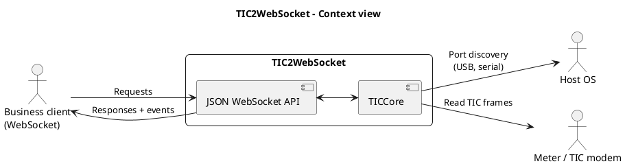
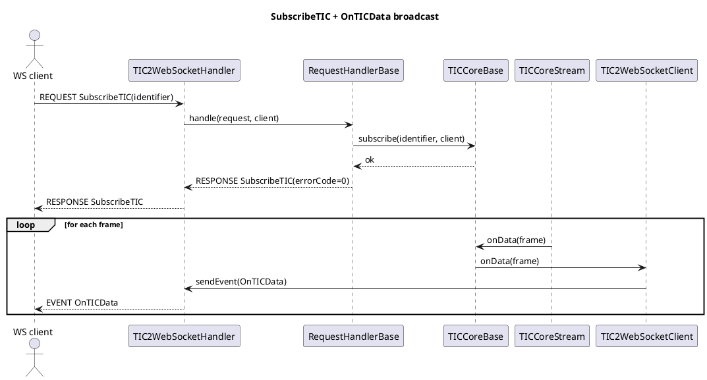

# Architecture

This page describes the technical architecture of **TIC2WebSocket**: its components, execution flows, responsibilities, and extension points.

## System goal

`TIC2WebSocket` exposes a JSON WebSocket interface to:

- discover available TICs;
- read a TIC frame on demand;
- subscribe to one or more TIC streams;
- receive real-time events (`OnTICData`, `OnError`).

The service bridges the **hardware/serial port** world (TIC modems) and **WebSocket** application clients.

## Context view

## Main components

The application is organized into several Java packages, each with clear responsibilities.

### Diagnostic package

- **TICCoreApp**: application for global TIC core tests and diagnostics
- **ModemFinderApp**: modem discovery test application
- **ModemPlugNotifierApp**: plug/unplug notification test application
- **SerialPortFinderApp**: serial port discovery test application
- **UsbPortFinderApp**: USB port discovery test application

### Utility package

- **Codec**: JSON encoding/decoding, TIC frames, etc.
- **Message**: generic message models (Request, Response, Event)
- **Task**: asynchronous task management
- **Time**: date and time utilities

### io package

- **Modem**: TIC modem management (serial port, USB)
- **ModemFinder**: dynamic discovery of connected modems
- **PlugNotifier**: plug/unplug event notifications

### frame package

- **TICFrame**: representation of a decoded TIC frame
- **TICFrameCodec**: TIC frame encoding/decoding

### stream package

- **TICCoreStream**: TIC data stream management (reading, decoding)
- **TICStreamReader**: reads a TIC stream from a modem
- **TICStreamModeDetector**: detects the TIC mode (historic, standard)

### core package

- **TICCoreBase**: application core, subscription management, notifications

### service package

- **TIC2WebSocketApplication**: TIC2WebSocket application entry point
- **TIC2WebSocketServer**: WebSocket server (Netty)
- **TIC2WebSocketHandler**: main WebSocket request handler
- **TIC2WebSocketRequestHandlerBase**: base class for business request handlers
- **TIC2WebSocketClientPool**: connected WebSocket clients management

## Execution flows

### Startup

1. The CLI is parsed (`picocli`) and configuration is loaded.
2. `TICCoreBase` is instantiated with the TIC mode and optional ports.
3. The Netty WebSocket server starts.
4. The core enables modem plug/unplug monitoring.

### Handling a WebSocket request

1. The handler receives a WebSocket text frame.
2. JSON is decoded into a `Message` then transformed into a `Request`.
3. `TIC2WebSocketRequestHandlerBase` performs the business operation.
4. The JSON response is sent back to the client.

### Broadcasting TIC events

1. A stream reads and decodes a new TIC frame.
2. `TICCoreBase` receives `onData` / `onError`.
3. Subscribers filtered by `TICIdentifier` are resolved.
4. Each client receives a WebSocket event.

## Sequence: subscribe then events

