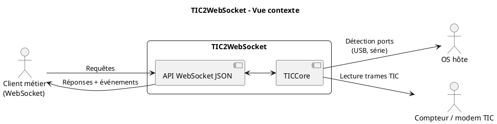
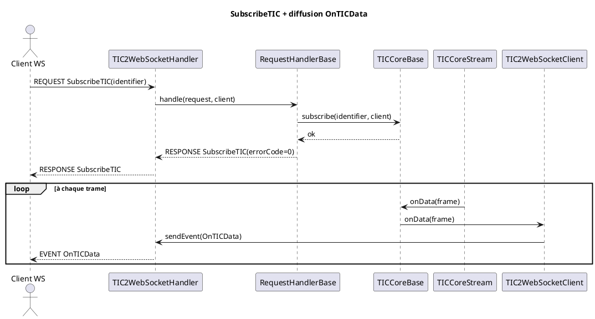

# Architecture

Cette page décrit l’architecture technique de **TIC2WebSocket** : ses composants, ses flux d’exécution, ses responsabilités et ses points d’extension.

## Objectif du système

`TIC2WebSocket` expose une interface WebSocket JSON pour :

- découvrir les TIC disponibles ;
- lire une trame TIC à la demande ;
- s’abonner à un ou plusieurs flux TIC ;
- recevoir des événements temps réel (`OnTICData`, `OnError`).

Le service fait le pont entre le monde **matériel/port série** (modems TIC) et des clients applicatifs **WebSocket**.

## Vue contexte

## Composants principaux

L'application est organisée en plusieurs packages Java, chacun avec des responsabilités claires.

### Package diagnostic

- **TICCoreApp** : application pour tests et diagnostics globaux du core TIC
- **ModemFinderApp** : application de test de détection de modems
- **ModemPlugNotifierApp** : application de test de notification de plug/unplug
- **SerialPortFinderApp** : application de test de détection de ports série
- **UsbPortFinderApp** : application de test de détection de ports USB

### Package utilitaire

- **Codec** : encodage/décodage JSON, trames TIC, etc
- **Message** : modèles de messages génériques (Request, Response, Event)
- **Task** : gestion de tâches asynchrones
- **Time** : utilitaires de temps et de date

### Package io
- **Modem** : gestion d’un modem TIC (port série, USB)
- **ModemFinder** : détection dynamique des modems connectés
- **PlugNotifier** : notification des événements de plug/unplug

### Package frame
- **TICFrame** : représentation d’une trame TIC décodée
- **TICFrameCodec** : encodage/décodage de trames TIC

### Package stream
- **TICCoreStream** : gestion d’un flux de données TIC (lecture, décodage)
- **TICStreamReader** : lecture d’un flux TIC à partir d’un modem
- **TICStreamModeDetector** : détection du mode TIC (historique, standard)

### Package core
- **TICCoreBase** : cœur de l’application, gestion des abonnements, notifications

### Package service
- **TIC2WebSocketApplication** : point d’entrée de l’application TIC2WebSocket
- **TIC2WebSocketServer** : serveur WebSocket (Netty)
- **TIC2WebSocketHandler** : handler principal des requêtes WebSocket
- **TIC2WebSocketRequestHandlerBase** : base pour les handlers de requêtes métier
- **TIC2WebSocketClientPool** : gestion des clients WebSocket connectés

## Flux d’exécution

### Démarrage

1. La CLI est parsée (`picocli`) et la configuration est chargée.
2. `TICCoreBase` est instancié avec le mode TIC et les ports éventuels.
3. Le serveur Netty WebSocket démarre.
4. Le core active la surveillance de plug/unplug modem.

### Traitement d’une requête WebSocket

1. Le handler reçoit une trame texte WebSocket.
2. Le JSON est décodé en `Message` puis transformé en `Request`.
3. `TIC2WebSocketRequestHandlerBase` exécute l’opération métier.
4. La réponse JSON est renvoyée au client.

### Diffusion d’événements TIC

1. Un stream lit et décode une nouvelle trame TIC.
2. `TICCoreBase` reçoit `onData` / `onError`.
3. Les abonnés filtrés par `TICIdentifier` sont résolus.
4. Chaque client reçoit un événement WebSocket.

## Séquence : abonnement puis événements

